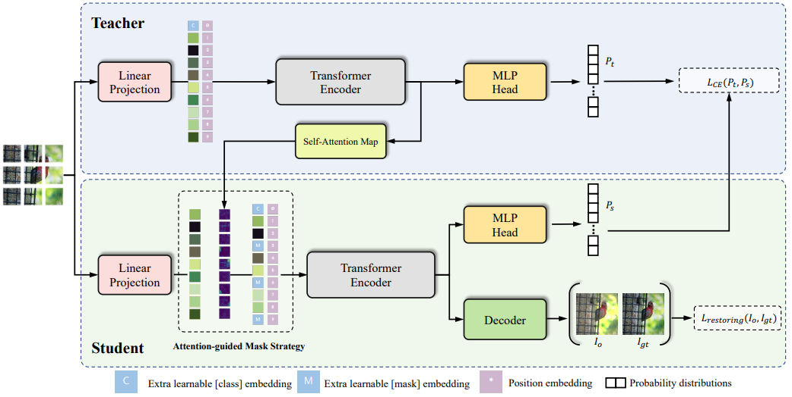

# Representation learning Papers

### Transformer

+ **DVT** - Deformable Video Transformer (CVPR 2022)  
Jue Wang, Lorenzo Torresani   
[[paper](https://arxiv.org/pdf/2203.16795.pdf)]  [code]   

+ **DW-ViT** - Beyond Fixation: Dynamic Window Visual Transformer (CVPR 2022)  
Pengzhen Ren, Changlin Li, Guangrun Wang, Yun Xiao, Qing Du, Xiaodan Liang, Xiaojun Chang   
[[paper](https://arxiv.org/abs/2203.12856)]  [[code](https://github.com/pzhren/DW-ViT)]  

+ **Swin** - Swin Transformer: Hierarchical Vision Transformer using Shifted Windows (ICCV 2021)  
Ze Liu, Yutong Lin, Yue Cao, Han Hu, Yixuan Wei, Zheng Zhang, Stephen Lin, Baining Guo   
[[paper](https://openaccess.thecvf.com/content/ICCV2021/papers/Liu_Swin_Transformer_Hierarchical_Vision_Transformer_Using_Shifted_Windows_ICCV_2021_paper.pdf)]  [[code](https://github.com/microsoft/Swin-Transformer)]  

### Big Vision Models  
+ A Roadmap for Big Model (arXiv 2022)  
Sha Yuan, Hanyu Zhao, et al..   
[[paper](https://arxiv.org/pdf/2203.14101.pdf)]  

### Masked Image Modeling

+ **MAE** - Masked Autoencoders Are Scalable Vision Learners (CVPR 2022)   
Kaiming He, Xinlei Chen, Saining Xie, Yanghao Li, Piotr Dollár, and Ross Girshick   
[[paper](https://arxiv.org/abs/2111.06377)] [[code](https://github.com/facebookresearch/mae)]   

+ **SimMIM** - SimMIM: A Simple Framework for Masked Image Modeling (arXiv 2021-11)  
Zhenda Xie, Zheng Zhang, Yue Cao, Yutong Lin, Jianmin Bao, Zhuliang Yao, Qi Dai, Han Hu  
[[paper](https://arxiv.org/abs/2111.09886)]  [[code](https://github.com/microsoft/SimMIM)]

+ **iBOT** - iBOT: Image BERT Pre-Training with Online Tokenizer  (ICLR 2022)   
Jinghao Zhou, Chen Wei, Huiyu Wang, Wei Shen, Cihang Xie, Alan Yuille, Tao Kong  
[[paper](https://arxiv.org/pdf/2111.07832.pdf)]  [[code](https://github.com/bytedance/ibot)]   

+ **DINO** - Emerging Properties in Self-Supervised Vision Transformers  (ICCV 2021)   
Mathilde Caron, Hugo Touvron, Ishan Misra, Hervé Jégou, Julien Mairal, Piotr Bojanowski, Armand Joulin  
[[paper](https://openaccess.thecvf.com/content/ICCV2021/papers/Caron_Emerging_Properties_in_Self-Supervised_Vision_Transformers_ICCV_2021_paper.pdf)]  [[code](https://github.com/facebookresearch/dino)]   

+ **EsViT** - Efficient Self-supervised Vision Transformers for Representation Learning  (arXiv 2021)    
Zhenda Xie, Yutong Lin, Zhuliang Yao, Zheng Zhang, Qi Dai, Yue Cao, Han Hu  
[[paper](https://arxiv.org/abs/2106.09785)]    

+ **BEiT** - BEiT: BERT Pre-Training of Image Transformers  (arXiv 2021-6)   
Hangbo Bao, Li Dong, Furu Wei  
[[paper](https://arxiv.org/abs/2106.08254)]  [[code](https://github.com/microsoft/unilm/tree/master/beit)] 

+ **MST** - MST: Masked Self-Supervised Transformer for Visual Representation  (NeurIPS 2021)   
Zhaowen Li, Zhiyang Chen, Fan Yang, Wei Li, Yousong Zhu, Chaoyang Zhao, Rui Deng, Liwei Wu, Rui Zhao, Ming Tang, Jinqiao Wang  
[[paper](https://arxiv.org/abs/2106.05656)]
    
 
Notes
 

    

  

+ **VIT** - An image is worth 16x16 words: Transformers for image recognition at scale  (ICLR 2021)   
Alexey Dosovitskiy, Lucas Beyer, Alexander Kolesnikov, Dirk Weissenborn, Xiaohua Zhai, Thomas Unterthiner, Mostafa Dehghani, Matthias Minderer, Georg Heigold, Sylvain Gelly, Jakob Uszkoreit, Neil Houlsby   
[[paper](https://arxiv.org/pdf/2010.11929.pdf)] [[code](https://github.com/google-research/vision_transformer)]
  

    
Notes

       
    - Key idea:
         - 
     - Performance:
        - 
    

### Contrastive Learning
CoCa: Contrastive Captioners are Image-Text Foundation Models

+ CoCa: Contrastive Captioners are Image-Text Foundation Models (arXiv 2022-05)   
Jiahui Yu, Zirui Wang, Vijay Vasudevan, Legg Yeung, Mojtaba Seyedhosseini, Yonghui Wu   
[[paper](https://arxiv.org/pdf/2205.01917.pdf)]  [[code]()]  

+ On the Importance of Asymmetry for Siamese Representation Learning  (CVPR 2022)   
Xiao Wang, Haoqi Fan, Yuandong Tian, Daisuke Kihara, Xinlei Chen   
[[paper](https://arxiv.org/pdf/2204.00613.pdf)]  [[code]( https://github.com/facebookresearch/asym-siam)]  

+ **LoGo** - Leverage Your Local and Global Representations: A New Self-Supervised Learning Strategy  (arXiv 2021)   
Tong Zhang, Congpei Qiu, Wei Ke, Sabine Süsstrunk, Mathieu Salzmann   
[[paper](https://arxiv.org/pdf/2203.17205.pdf)]  [[code](https://github.com/ztt1024/LoGo-SSL)]  

+ **MoBY** - Self-Supervised Learning with Swin Transformers  (arXiv 2021)   
Chunyuan Li, Jianwei Yang, Pengchuan Zhang, Mei Gao, Bin Xiao, Xiyang Dai, Lu Yuan, Jianfeng Gao  
[[paper](https://arxiv.org/abs/2106.09785)]  [[code](https://github.com/SwinTransformer/Transformer-SSL)] 

+ **MoCo_v3** - An Empirical Study of Training Self-Supervised Vision Transformers (ICCV 2021)  
Xinlei Chen, Saining Xie, Kaiming He   
[[paper](https://openaccess.thecvf.com/content/ICCV2021/papers/Chen_An_Empirical_Study_of_Training_Self-Supervised_Vision_Transformers_ICCV_2021_paper.pdf)]  [[code](https://github.com/facebookresearch/moco-v3)]   

+ **SlowFast** - A Large-Scale Study on Unsupervised Spatiotemporal Representation Learning (CVPR 2021)  
Christoph Feichtenhofer, Haoqi Fan, Bo Xiong, Ross Girshick, and Kaiming He   
[[paper](https://arxiv.org/abs/2104.14558)]  [[code](https://github.com/facebookresearch/SlowFast)]  

+ **SimSiam** - Exploring Simple Siamese Representation Learning (CVPR 2021)  
Xinlei Chen and Kaiming He   
[[paper](https://arxiv.org/pdf/2011.10566.pdf)]  [[code](https://github.com/facebookresearch/simsiam)]  

+ **MoCo_v2** - Improved Baselines with Momentum Contrastive Learning (arXiv, 2020-3)  
Xinlei Chen, Haoqi Fan, Ross Girshick, and Kaiming He   
[[paper](https://arxiv.org/pdf/2003.04297.pdf)]  [[code](https://github.com/facebookresearch/moco)]   

+ **BYOL** - Bootstrap your own latent: A new approach to self-supervised learning  (NeurIPS 2020) 
Jean-Bastien Grill, Florian Strub, Florent Altché, Corentin Tallec, Pierre Richemond, Elena Buchatskaya, Carl Doersch, Bernardo Avila Pires, Zhaohan Guo, Mohammad Gheshlaghi Azar, Bilal Piot, koray kavukcuoglu, Remi Munos, Michal Valko
[[paper](https://proceedings.neurips.cc/paper/2020/file/f3ada80d5c4ee70142b17b8192b2958e-Paper.pdf)]  [[code](https://github.com/deepmind/deepmind-research/tree/master/byol)]  

+ **SwAV** - Unsupervised Learning of Visual Features by Contrasting Cluster Assignments (NeurIPS 2020)  
Mathilde Caron, Ishan Misra, Julien Mairal, Priya Goyal, Piotr Bojanowski, Armand Joulin  
[[paper](https://proceedings.neurips.cc/paper/2020/file/70feb62b69f16e0238f741fab228fec2-Paper.pdf)]  [[code]( https://github.com/facebookresearch/swav)]   

+ **MoCo_v1** - Momentum Contrast for Unsupervised Visual Representation Learning (CVPR 2020)  
Kaiming He, Haoqi Fan, Yuxin Wu, Saining Xie, and Ross Girshick   
[[paper](https://arxiv.org/abs/1911.05722)]  [[code](https://github.com/facebookresearch/moco)]   

+ **SimCLR** - A simple framework for contrastive learning of visual representations (PMLR 2020) 
Ting Chen, Simon Kornblith, Mohammad Norouzi, Geoffrey Hinton  
[[paper](https://arxiv.org/abs/2002.05709)]  [[code](https://github.com/google-research/simclr)]  

### Others
+ ** ** - Exploiting Explainable Metrics for Augmented SGD (CVPR 2022) 
Mahdi S. Hosseini, Mathieu Tuli, Konstantinos N. Plataniotis   
[[paper](https://arxiv.org/pdf/2203.16723.pdf)]  [[code](https://github.com/mahdihosseini/RMSGD)]  

+ ** ** - Controllable Augmentations for Video Representation Learning (arXiv 2022)  
Rui Qian, Weiyao Lin, John See, Dian Li   
[[paper](https://arxiv.org/pdf/2203.16632.pdf)]  [code]  

+ ** ** - mc-BEiT: Multi-choice Discretization for Image BERT Pre-training (arXiv 2022)   
Xiaotong Li, Yixiao Ge, Kun Yi, Zixuan Hu, Ying Shan, Ling-Yu Duan   
[[paper](https://arxiv.org/abs/2203.15371)]  [code]  

